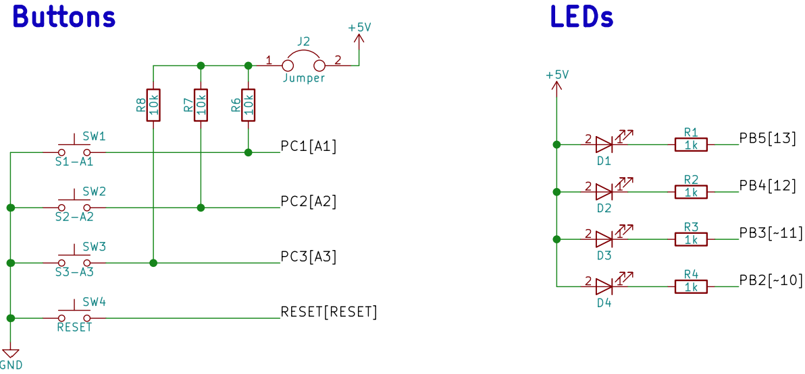

# Lab 4: Interrupts, timers

## Preparation tasks (done before the lab at home)

Consider an n-bit number that we increment based on the clock signal. If we reach its maximum value and try to increase it, the value will be reset. We call this state an overflow. The overflow time depends on the frequency of the clock signal, the number of bits, and on the prescaler value:

&nbsp;

&nbsp;

Calculate the overflow times for three Timer/Counter modules that contain ATmega328P if CPU clock frequency is 16&nbsp;MHz. Complete the following table for given prescaler values. Note that, Timer/Counter2 is able to set 7 prescaler values, including 32 and 128.

| **Module** | **Number of bits** | **1** | **8** | **32** | **64** | **128** | **256** | **1024** |
| :-: | :-: | :-: | :-: | :-: | :-: | :-: | :-: | :-: |
| Timer/Counter0 | 8  | 16u | 128u | -- | 1m | -- | 4m | 16m |
| Timer/Counter1 | 16 | 4m | 33m | -- | 262m | -- | 1,1 | 4,2 |
| Timer/Counter2 | 8  | 16u | 128u | 512u | 1m | 2m | 4m | 16m |

Shields are boards that can be attached to an Arduino board, significantly expand its capabilities, and makes prototyping much faster. See schematic of [Multi-function shield](../../Docs/arduino_shield.pdf) and find out the connection of four LEDs (D1, D2, D3, D4) and three push buttons (S1-A1, S2-A2, S3-A3).

The timer modules can be configured with several special purpose registers. According to the [ATmega328P datasheet](https://www.microchip.com/wwwproducts/en/ATmega328p) (eg in the **8-bit Timer/Counter0 with PWM > Register Description** section), which I/O registers and which bits configure the timer operations?

| **Module** | **Operation** | **I/O register(s)** | **Bit(s)** |
| :-: | :-- | :-: | :-- |
| Timer/Counter0 | Prescaler  8-bit data value Overflow interrupt enable | TCCR0B  TCNT0 TIMSK0 | CS02, CS01, CS00 (000: stopped, 001: 1, 010: 8, 011: 64, 100: 256, 101: 1024) TCNT0[7:0] TOIE0 (1: enable, 0: disable) |
| Timer/Counter1 | Prescaler  16-bit data value Overflow interrupt enable | TCCR1B  TCNT1H, TCNT1L TIMSK1 | CS12, CS11, CS10 (000: stopped, 001: 1, 010: 8, 011: 64, 100: 256, 101: 1024) TCNT1[15:0] TOIE1 (1: enable, 0: disable) |
| Timer/Counter2 | Prescaler  8-bit data value Overflow interrupt enable | TCCR2B  TCNT2 TIMSK2 | CS22, CS21, CS20 (000: stopped, 001: 1, 010: 8, 011: 32, 100: 64, 101: 128, 110: 256, 111: 1024) TCNT2[7:0] TOIE2 (1: enable, 0: disable) |

See the [ATmega328P datasheet](https://www.microchip.com/wwwproducts/en/ATmega328p) (section **Interrupts > Interrupt Vectors in ATmega328 and ATmega328P**) for sources of interruptions that can occur on ATmega328P. Complete the selected interrupt sources in the following table. The names of the interrupt vectors in C can be found in [C library manual](https://www.nongnu.org/avr-libc/user-manual/group__avr__interrupts.html).

| **Program address** | **Source** | **Vector name** | **Description** |
| :-: | :-- | :-- | :-- |
| 0x0000 | RESET | -- | Reset of the system |
| 0x0002 | INT0  | `INT0_vect` | External Interrupt Request 0 |
| 0x0004 | INT1 | `INT1_vect` | External Interrupt Request 1 |
| 0x0006 | PCINT0 | `PCINT0_vect` | Pin Change Interrupt Request 0 |
| 0x0008 | PCINT1 | `PCINT1_vect` | Pin Change Interrupt Request 1 |
| 0x000A | PCINT2 | `PCINT2_vect` | Pin Change Interrupt Request 2 |
| 0x000C | WDT | `WDT_vect` | Watchdog Time-out Interrupt |
| 0x0012 | TIMER2_OVF | `TIMER2_OVF_vect` | Timer/Counter2 Overflow |
| 0x0018 | TIMER1_COMPB | `TIMER1_COMPB_vect` | Compare match between Timer/Counter1 value and channel B compare value |
| 0x001A | TIMER1_OVF | `TIMER1_OVF_vect` | Timer/Counter1 Overflow |
| 0x0020 | TIMER0_OVF | `TIMER0_OVF_vect` | Timer/Counter0 Overflow |
| 0x0024 | USART_RX | `USART_RX_vect` | USART Rx Complete |
| 0x002A | ADC | `ADC_vect` | ADC Conversion Complete |
| 0x0030 | TWI | `TWI_vect` | 2-wire Serial Interface |

All interrupts are disabled by default. If you want to use them, you must first enable them individually in specific control registers and then enable them centrally with the `sei()` command (Set interrupt). You can also centrally disable all interrupts with the `cli()` command (Clear interrupt).
